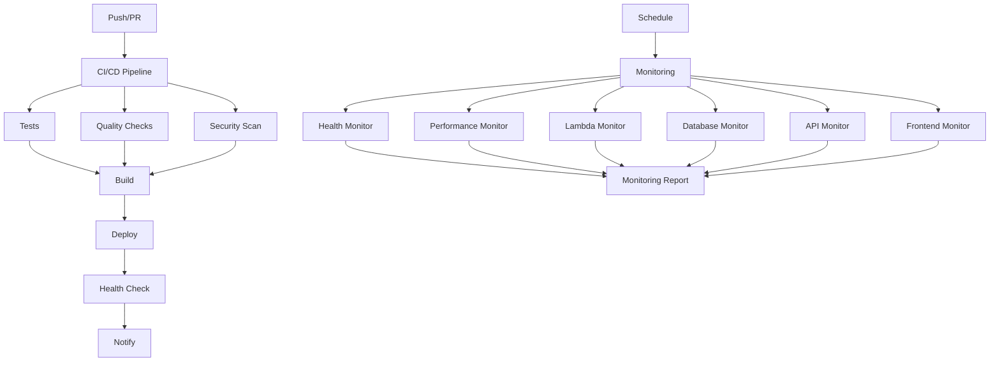

# GitHub Actions Workflows

This directory contains GitHub Actions workflows for CI/CD, testing, deployment, and monitoring.

## Workflows Overview

### 1. `ci-cd.yml` - Main CI/CD Pipeline
Comprehensive pipeline that runs on every push and pull request.

**Triggers:**
- Push to `main` or `develop` branches
- Pull requests to `main` or `develop` branches
- Manual workflow dispatch

**Jobs:**
- **Test**: Runs all test suites (unit, integration, API, E2E, AWS, performance)
- **Quality**: Code quality checks (ESLint, Prettier)
- **Security**: Security scanning (npm audit, Snyk)
- **Build**: Builds and packages the application
- **Deploy**: Deploys to appropriate environment based on branch
- **Health Check**: Post-deployment health verification
- **Notify**: Sends notifications to Slack

**Environments:**
- `development`: Auto-deploy from `develop` branch
- `staging`: Manual deployment
- `production`: Auto-deploy from `main` branch

### 2. `test.yml` - Test Suite
Dedicated workflow for running comprehensive tests.

**Triggers:**
- Push to `main` or `develop` branches
- Pull requests to `main` or `develop` branches
- Daily schedule (2 AM UTC)

**Jobs:**
- **Unit Tests**: Lambda and frontend unit tests
- **Integration Tests**: End-to-end workflow tests
- **API Tests**: API endpoint tests
- **E2E Tests**: End-to-end user journey tests
- **AWS Tests**: Infrastructure tests
- **Performance Tests**: Performance and load tests
- **Test Summary**: Aggregates and reports test results

### 3. `deploy.yml` - Deployment Workflow
Manual deployment workflow with validation and rollback.

**Triggers:**
- Manual workflow dispatch only

**Features:**
- Environment selection (dev, staging, prod)
- Option to skip tests
- Pre-deployment validation
- Build and package
- Lambda function deployment
- Frontend deployment
- Post-deployment verification
- Automatic rollback on failure
- Success/failure notifications

**Jobs:**
- **Validate**: Pre-deployment validation
- **Build**: Build and package artifacts
- **Deploy Lambda**: Deploy Lambda functions
- **Deploy Frontend**: Deploy frontend application
- **Verify Deployment**: Post-deployment verification
- **Rollback**: Automatic rollback on failure
- **Notify Success**: Success notifications

### 4. `monitor.yml` - Monitoring Workflow
Continuous monitoring and health checks.

**Triggers:**
- Every 5 minutes (scheduled)
- Manual workflow dispatch

**Jobs:**
- **Health Monitor**: Overall system health check
- **Performance Monitor**: Performance testing
- **Lambda Monitor**: Lambda function monitoring
- **Database Monitor**: DynamoDB health monitoring
- **API Monitor**: API endpoint monitoring
- **Frontend Monitor**: Frontend health monitoring
- **Monitoring Report**: Generates monitoring summary

## Configuration

### Required Secrets

The workflows require the following secrets to be configured in GitHub:

```bash
# AWS Credentials
AWS_ACCESS_KEY_ID
AWS_SECRET_ACCESS_KEY

# Slack Notifications
SLACK_WEBHOOK_URL

# Security Scanning
SNYK_TOKEN
```

### Environment Variables

All workflows use these environment variables:

```yaml
env:
  NODE_VERSION: '18'
  AWS_REGION: 'eu-central-1'
```

### GitHub Environments

Configure these environments in GitHub repository settings:

1. **development**
   - Required reviewers: None
   - Deployment branches: `develop`

2. **staging**
   - Required reviewers: 1
   - Deployment branches: Any

3. **production**
   - Required reviewers: 2
   - Deployment branches: `main`

## Usage

### Automatic Deployment

**Development:**
```bash
git push origin develop
# Automatically triggers deployment to development environment
```

**Production:**
```bash
git push origin main
# Automatically triggers deployment to production environment
```

### Manual Deployment

1. Go to GitHub Actions tab
2. Select "Deployment" workflow
3. Click "Run workflow"
4. Select environment and options
5. Click "Run workflow"

### Manual Testing

1. Go to GitHub Actions tab
2. Select "Test Suite" workflow
3. Click "Run workflow"
4. Click "Run workflow"

### Manual Monitoring

1. Go to GitHub Actions tab
2. Select "Monitoring" workflow
3. Click "Run workflow"
4. Select environment
5. Click "Run workflow"

## Workflow Dependencies



## Customization

### Adding New Tests

To add new test types:

1. Add test script to `package.json`:
```json
{
  "scripts": {
    "test:new-type": "jest --config jest.config.js tests/new-type"
  }
}
```

2. Add job to `test.yml`:
```yaml
new-type-tests:
  name: New Type Tests
  runs-on: ubuntu-latest
  steps:
    - name: Run new type tests
      run: npm run test:new-type
```

### Adding New Environments

To add a new environment:

1. Create environment in GitHub repository settings
2. Add environment-specific configuration
3. Update deployment workflows
4. Add environment-specific secrets

### Custom Notifications

To customize notifications:

1. Update Slack webhook URLs
2. Modify notification messages in workflows
3. Add new notification channels (email, Teams, etc.)

### Performance Thresholds

To adjust performance thresholds:

1. Update test files in `tests/performance/`
2. Modify monitoring thresholds in `monitor.yml`
3. Update alert conditions

## Troubleshooting

### Common Issues

1. **Workflow fails on AWS credentials**
   - Check if secrets are properly configured
   - Verify AWS permissions

2. **Tests fail intermittently**
   - Check for race conditions
   - Add retry logic
   - Review test timeouts

3. **Deployment fails**
   - Check AWS resource limits
   - Verify environment configuration
   - Review deployment logs

4. **Monitoring alerts too frequent**
   - Adjust monitoring thresholds
   - Review alert conditions
   - Add cooldown periods

### Debug Mode

Enable debug mode for workflows:

```yaml
- name: Debug step
  run: |
    echo "Debug information"
    env | sort
  env:
    ACTIONS_STEP_DEBUG: true
```

### Log Analysis

Access workflow logs:

1. Go to GitHub Actions tab
2. Click on failed workflow
3. Click on failed job
4. Click on failed step
5. Review logs for errors

## Best Practices

1. **Keep workflows fast**
   - Use parallel jobs where possible
   - Cache dependencies
   - Optimize test execution

2. **Fail fast**
   - Run critical tests first
   - Use appropriate exit codes
   - Clear error messages

3. **Security**
   - Use secrets for sensitive data
   - Limit permissions
   - Regular security updates

4. **Monitoring**
   - Set up proper alerts
   - Monitor workflow performance
   - Regular maintenance

5. **Documentation**
   - Keep workflows documented
   - Update README files
   - Document changes

## Support

For issues or questions:

1. Check workflow logs
2. Review GitHub Actions documentation
3. Check AWS service status
4. Review environment configuration
5. Contact team for assistance
